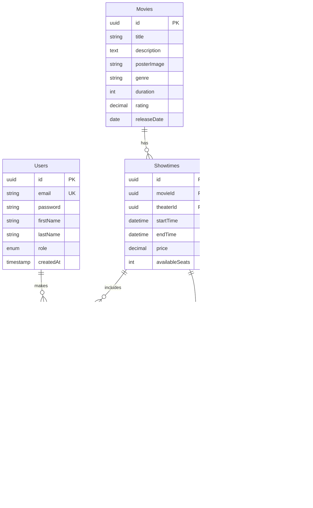

# 🎬 Movie Reservation System


---

[Live API Demo](https://movie-reservation-api-h99d.onrender.com/health)

---

## 🎯 Overview

This Movie Reservation System is an advanced backend application that handles the complete lifecycle of movie ticket bookings. Built with Node.js and Express, it implements complex business logic including:

- **Concurrent Booking Prevention**: Uses database transactions and row-level locking to prevent overbooking
- **Scheduling Management**: Handles showtime conflicts and theater availability
- **Role-Based Access Control**: Separate admin and user permissions
- **Comprehensive Reporting**: Revenue tracking, capacity analysis, and popularity metrics

**Problem Statement**: Movie theaters need a reliable system to manage bookings, prevent double-booking, and track performance metrics.

**Solution**: A robust API with transactional integrity, real-time seat availability, and detailed analytics.

---

## ✨ Features

### Core Functionality

#### 🔐 User Authentication & Authorization
- ✅ User registration and login with JWT tokens
- ✅ Role-based access control (Admin and User roles)
- ✅ Secure password hashing with bcrypt
- ✅ Token-based authentication with 7-day expiration
- ✅ Admin promotion capabilities

#### 🎬 Movie Management (Admin)
- ✅ CRUD operations for movies
- ✅ Movie categorization by genre
- ✅ Movie metadata (title, description, poster, duration, rating)
- ✅ Search and filter capabilities
- ✅ Pagination support

#### 🎭 Theater & Showtime Management
- ✅ Multiple theater support
- ✅ Configurable seating layouts (rows and columns)
- ✅ Seat type classification (standard, premium, VIP)
- ✅ Showtime scheduling with conflict detection
- ✅ Automatic end-time calculation based on movie duration
- ✅ Theater availability validation

#### 🎫 Reservation System
- ✅ Real-time seat availability checking
- ✅ Multi-seat booking in single transaction
- ✅ Concurrent booking prevention with database locks
- ✅ Unique booking reference generation
- ✅ Reservation history tracking
- ✅ Cancellation for upcoming shows only
- ✅ Automatic seat pool management


---

## 🛠️ Tech Stack

### Backend
- **Runtime**: Node.js 18+
- **Framework**: Express.js 4.x
- **ORM**: Sequelize 6.x
- **Database**: MySQL 8.x
- **Authentication**: JWT (jsonwebtoken)
- **Password Hashing**: bcrypt

### Key Libraries
- **cors**: Cross-origin resource sharing
- **dotenv**: Environment configuration
- **mysql2**: MySQL database driver

---

## 💾 Database Schema




## 🚀 Getting Started

### Prerequisites

- **Node.js** 18.x or higher - [Download](https://nodejs.org/)
- **MySQL** 8.x or higher - [Download](https://www.mysql.com/downloads/)
- **npm** or **yarn** package manager
- **Git** for version control

### Installation

#### 1. Clone the Repository

```bash
git clone https://github.com/dev-k99/Movie-Reservation-System
cd movie-reservation-system
```

#### 2. Install Dependencies

```bash
npm install
```


#### 4. Configure Environment Variables

Create a `.env` file in the root directory:

```bash
cp .env.example .env
```

Update `.env` with your configuration:


#### 5. Initialize Database (First Time Only)

```bash
# This will create tables and seed initial data
npm start
```

**⚠️ Important**: After first run, set `DB_FORCE_SYNC=false` in `.env` to prevent data loss on restart.

#### 6. Start Development Server

```bash
npm run dev
```

The API will be available at `http://localhost:3000`

---

## 📚 API Documentation

### Base URL

```
http://localhost:3000/api
```


---

### 🎬 Movie Endpoints

# API Documentation
http://localhost:3000

---

## Auth

### Register
**POST** `/api/auth/register`  
Register a new user

### Login
**POST** `/api/auth/login`  
Login user and return JWT token

### Get Profile
**GET** `/api/auth/me`  
Get current logged-in user profile

---

## Movies

### Get All Movies
**GET** `/api/movies`  
Get all movies

### Create Movie
**POST** `/api/movies` *(Admin only)*  
Create a new movie

### Get Genres
**GET** `/api/movies/meta/genres`  
Get available movie genres

### Get Movie by ID
**GET** `/api/movies/{id}`  
Get a single movie by ID

### Update Movie
**PUT** `/api/movies/{id}` *(Admin only)*  
Update an existing movie

### Delete Movie
**DELETE** `/api/movies/{id}` *(Admin only)*  
Delete a movie


#### Get All Genres
```http
GET /api/movies/meta/genres
```

---

### 🎭 Showtime Endpoints

#### Get Showtimes for a Date
```http
GET /api/showtimes?date=2024-01-20&movieId=uuid
```

**Required Query Parameters:**
- `date`: Date in YYYY-MM-DD format

#### Get Showtime with Available Seats
```http
GET /api/showtimes/:id
```

**Response:**
```json
{
  "success": true,
  "data": {
    "showtime": {
      "id": "uuid",
      "startTime": "2024-01-20T19:00:00Z",
      "endTime": "2024-01-20T21:32:00Z",
      "price": "12.50",
      "availableSeats": 85,
      "Movie": { "title": "The Matrix", ... },
      "Theater": { "name": "Theater 1", ... }
    },
    "seats": [
      {
        "id": "uuid",
        "seatNumber": "A1",
        "row": "A",
        "column": 1,
        "type": "standard",
        "isAvailable": true
      },
      ...
    ]
  }
}
```

#### Create Showtime (Admin Only)
```http
POST /api/showtimes
Authorization: Bearer <admin_token>
Content-Type: application/json

{
  "movieId": "uuid",
  "theaterId": "uuid",
  "startTime": "2024-01-20T19:00:00Z",
  "price": 12.50
}
```

**Validation:**
- Checks for theater scheduling conflicts
- Automatically calculates end time based on movie duration
- Initializes available seats from theater capacity

#### Update Showtime (Admin Only)
```http
PUT /api/showtimes/:id
Authorization: Bearer <admin_token>
Content-Type: application/json

{
  "price": 15.00
}
```

**Restrictions:**
- Cannot change start time if showtime has existing reservations

#### Delete Showtime (Admin Only)
```http
DELETE /api/showtimes/:id
Authorization: Bearer <admin_token>
```

**Restrictions:**
- Cannot delete showtime with confirmed reservations

---

### 🎫 Reservation Endpoints

#### Create Reservation
```http
POST /api/reservations
Authorization: Bearer <token>
Content-Type: application/json

{
  "showtimeId": "uuid",
  "seatIds": ["seat-uuid-1", "seat-uuid-2", "seat-uuid-3"]
}
```

**Business Logic:**
1. Uses database transaction for atomicity
2. Implements row-level locking to prevent race conditions
3. Validates seat availability
4. Checks for duplicate bookings
5. Generates unique booking reference
6. Updates available seat count
7. Calculates total price

**Response: 201 Created**
```json
{
  "success": true,
  "message": "Reservation created successfully",
  "data": {
    "reservation": {
      "id": "uuid",
      "bookingReference": "A7B3C9D2",
      "totalPrice": "37.50",
      "status": "confirmed",
      "movie": { "title": "The Matrix", ... },
      "theater": { "name": "Theater 1" },
      "showtime": {
        "startTime": "2024-01-20T19:00:00Z",
        "endTime": "2024-01-20T21:32:00Z"
      },
      "seats": [
        { "seatNumber": "A1", "row": "A", "column": 1, "type": "standard" },
        ...
      ]
    }
  }
}
```

#### Get User's Reservations
```http
GET /api/reservations/my-reservations?status=confirmed&upcoming=true
Authorization: Bearer <token>
```

**Query Parameters:**
- `status`: Filter by status (confirmed, cancelled)
- `upcoming`: Show only upcoming reservations (true/false)

#### Get Single Reservation
```http
GET /api/reservations/:id
Authorization: Bearer <token>
```

#### Cancel Reservation
```http
DELETE /api/reservations/:id
Authorization: Bearer <token>
```

**Business Logic:**
1. Uses database transaction
2. Validates reservation ownership
3. Checks if showtime is in the future
4. Updates reservation status to 'cancelled'
5. Returns seats to available pool

**Restrictions:**
- Can only cancel future reservations
- Can only cancel own reservations (unless admin)

#### Get All Reservations (Admin Only)
```http
GET /api/reservations/admin/all?status=confirmed&page=1&limit=20
Authorization: Bearer <admin_token>
```

---

### 📊 Reports Endpoints (Admin Only)

#### Get Overall Statistics
```http
GET /api/reports/stats
Authorization: Bearer <admin_token>
```

**Response:**
```json
{
  "success": true,
  "data": {
    "totalUsers": 150,
    "totalMovies": 25,
    "totalReservations": 1247,
    "totalRevenue": 15587.50,
    "recentReservations": 89
  }
}
```

#### Get Revenue Report
```http
GET /api/reports/revenue?startDate=2024-01-01&endDate=2024-01-31
Authorization: Bearer <admin_token>
```

**Response:**
```json
{
  "success": true,
  "data": {
    "summary": {
      "totalBookings": 450,
      "totalRevenue": 5625.00
    },
    "details": [
      {
        "movie": { "id": "uuid", "title": "The Matrix" },
        "showtime": { "id": "uuid", "startTime": "..." },
        "totalBookings": 85,
        "totalRevenue": 1062.50
      },
      ...
    ]
  }
}
```

#### Get Capacity Report
```http
GET /api/reports/capacity?startDate=2024-01-01&endDate=2024-01-31
Authorization: Bearer <admin_token>
```

**Response:**
```json
{
  "success": true,
  "data": {
    "averageOccupancy": "75.50",
    "showtimes": [
      {
        "showtimeId": "uuid",
        "movie": { "title": "The Matrix" },
        "theater": { "name": "Theater 1" },
        "startTime": "2024-01-20T19:00:00Z",
        "totalSeats": 100,
        "bookedSeats": 85,
        "availableSeats": 15,
        "occupancyRate": "85.00"
      },
      ...
    ]
  }
}
```

#### Get Popular Movies
```http
GET /api/reports/popular-movies?startDate=2024-01-01&endDate=2024-01-31&limit=10
Authorization: Bearer <admin_token>
```

#### Get Peak Times
```http
GET /api/reports/peak-times?startDate=2024-01-01&endDate=2024-01-31
Authorization: Bearer <admin_token>
```

---

## 🔐 Business Logic Implementation

### 1. Preventing Overbooking

**Challenge**: Multiple users trying to book the same seat simultaneously.

**Solution**:
```javascript
// Use database transactions with row-level locking
const transaction = await sequelize.transaction();

const showtime = await Showtime.findByPk(showtimeId, {
  lock: transaction.LOCK.UPDATE,  // Row-level lock
  transaction
});

// Check seat availability
const existingReservations = await ReservedSeat.findAll({
  where: { showtimeId, seatId: seatIds },
  include: [{ model: Reservation, where: { status: 'confirmed' } }],
  transaction
});

if (existingReservations.length > 0) {
  await transaction.rollback();
  return error('Seats already reserved');
}

// Create reservation
await Reservation.create({ ... }, { transaction });
await transaction.commit();
```

### 2. Showtime Scheduling Conflicts

**Challenge**: Preventing double-booking of theaters.

**Solution**:
```javascript
// Check for overlapping showtimes in the same theater
const conflictingShowtime = await Showtime.findOne({
  where: {
    theaterId,
    [Op.or]: [
      { startTime: { [Op.between]: [newStart, newEnd] } },
      { endTime: { [Op.between]: [newStart, newEnd] } },
      {
        [Op.and]: [
          { startTime: { [Op.lte]: newStart } },
          { endTime: { [Op.gte]: newEnd } }
        ]
      }
    ]
  }
});
```

### 3. Seat Availability Management

**Real-time tracking**:
- `availableSeats` column updated atomically in transactions
- Seats returned to pool on cancellation
- Soft-delete approach for data integrity

### 4. Booking Reference Generation

**Unique 8-character alphanumeric codes**:
```javascript
const generateBookingReference = () => {
  const chars = 'ABCDEFGHIJKLMNOPQRSTUVWXYZ0123456789';
  let reference = '';
  for (let i = 0; i < 8; i++) {
    reference += chars.charAt(Math.floor(Math.random() * chars.length));
  }
  return reference;
};
```

---

## 🔒 Security

### Authentication & Authorization
- **JWT Tokens**: Secure, stateless authentication
- **Password Hashing**: bcrypt with salt rounds
- **Role-Based Access Control**: Middleware-enforced permissions
- **Token Expiration**: 7-day validity with automatic refresh

### API Security
- **Input Validation**: Request body validation
- **SQL Injection Prevention**: Parameterized queries via Sequelize
- **CORS**: Configurable cross-origin policies
- **Error Handling**: Sanitized error messages

### Database Security
- **Transactions**: ACID compliance for data integrity
- **Row-Level Locking**: Prevents race conditions
- **Cascading Deletes**: Maintains referential integrity
- **Unique Constraints**: Prevents duplicate entries

## 📝 Project Structure

```
movie-reservation-system/
├── routes/
│   ├── auth.js              # Authentication endpoints
│   ├── movies.js            # Movie management
│   ├── showtimes.js         # Showtime scheduling
│   ├── reservations.js      # Booking system
│   └── reports.js           # Admin analytics
├── models.js                # Sequelize models
├── database.js              # Database configuration
├── middleware.js            # Auth & error handling
├── server.js                # Main application
├── package.json             # Dependencies
├── .env.example             # Environment template
├── .gitignore              # Git ignore rules
└── README.md               # Documentation
```

---

## 🤝 Contributing

Contributions are welcome! Please follow these steps:

1. Fork the repository
2. Create a feature branch (`git checkout -b feature/AmazingFeature`)
3. Commit your changes (`git commit -m 'Add some AmazingFeature'`)
4. Push to the branch (`git push origin feature/AmazingFeature`)
5. Open a Pull Request