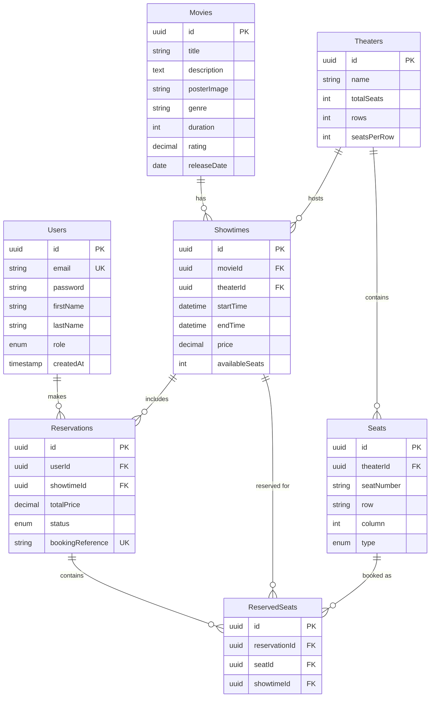

# 🎬 Movie Reservation System


---

## 📋 Table of Contents

- [Overview](#overview)
- [Features](#features)
- [Tech Stack](#tech-stack)
- [Database Schema](#database-schema)
- [Getting Started](#getting-started)
- [API Documentation](#api-documentation)
- [Business Logic](#business-logic)
- [Security](#security)
- [Testing](#testing)
- [Deployment](#deployment)
- [Contributing](#contributing)
- [License](#license)

---

## 🎯 Overview

This Movie Reservation System is an advanced backend application that handles the complete lifecycle of movie ticket bookings. Built with Node.js and Express, it implements complex business logic including:

- **Concurrent Booking Prevention**: Uses database transactions and row-level locking to prevent overbooking
- **Scheduling Management**: Handles showtime conflicts and theater availability
- **Role-Based Access Control**: Separate admin and user permissions
- **Comprehensive Reporting**: Revenue tracking, capacity analysis, and popularity metrics

**Problem Statement**: Movie theaters need a reliable system to manage bookings, prevent double-booking, and track performance metrics.

**Solution**: A robust API with transactional integrity, real-time seat availability, and detailed analytics.

---

## ✨ Features

### Core Functionality

#### 🔐 User Authentication & Authorization
- ✅ User registration and login with JWT tokens
- ✅ Role-based access control (Admin and User roles)
- ✅ Secure password hashing with bcrypt
- ✅ Token-based authentication with 7-day expiration
- ✅ Admin promotion capabilities

#### 🎬 Movie Management (Admin)
- ✅ CRUD operations for movies
- ✅ Movie categorization by genre
- ✅ Movie metadata (title, description, poster, duration, rating)
- ✅ Search and filter capabilities
- ✅ Pagination support

#### 🎭 Theater & Showtime Management
- ✅ Multiple theater support
- ✅ Configurable seating layouts (rows and columns)
- ✅ Seat type classification (standard, premium, VIP)
- ✅ Showtime scheduling with conflict detection
- ✅ Automatic end-time calculation based on movie duration
- ✅ Theater availability validation

#### 🎫 Reservation System
- ✅ Real-time seat availability checking
- ✅ Multi-seat booking in single transaction
- ✅ Concurrent booking prevention with database locks
- ✅ Unique booking reference generation
- ✅ Reservation history tracking
- ✅ Cancellation for upcoming shows only
- ✅ Automatic seat pool management

#### 📊 Admin Reporting & Analytics
- ✅ Overall statistics dashboard
- ✅ Revenue reports (by showtime, movie, date range)
- ✅ Capacity and occupancy analysis
- ✅ Popular movies ranking
- ✅ Peak time analysis
- ✅ Booking trends visualization

---

## 🛠️ Tech Stack

### Backend
- **Runtime**: Node.js 18+
- **Framework**: Express.js 4.x
- **ORM**: Sequelize 6.x
- **Database**: MySQL 8.x
- **Authentication**: JWT (jsonwebtoken)
- **Password Hashing**: bcrypt

### Key Libraries
- **cors**: Cross-origin resource sharing
- **dotenv**: Environment configuration
- **mysql2**: MySQL database driver

### Development Tools
- **nodemon**: Auto-restart during development
- **Postman**: API testing

---

## 💾 Database Schema



### Key Relationships

1. **User → Reservations**: One-to-Many (A user can have multiple reservations)
2. **Movie → Showtimes**: One-to-Many (A movie can have multiple showtimes)
3. **Theater → Showtimes**: One-to-Many (A theater can host multiple showtimes)
4. **Theater → Seats**: One-to-Many (A theater contains multiple seats)
5. **Showtime → Reservations**: One-to-Many (A showtime can have multiple reservations)
6. **Reservation → ReservedSeats**: One-to-Many (A reservation can include multiple seats)
7. **Seat → ReservedSeats**: One-to-Many (A seat can be reserved for multiple showtimes)

---

## 🚀 Getting Started

### Prerequisites

- **Node.js** 18.x or higher - [Download](https://nodejs.org/)
- **MySQL** 8.x or higher - [Download](https://www.mysql.com/downloads/)
- **npm** or **yarn** package manager
- **Git** for version control

### Installation

#### 1. Clone the Repository

```bash
git clone https://github.com/yourusername/movie-reservation-system.git
cd movie-reservation-system
```

#### 2. Install Dependencies

```bash
npm install
```

#### 3. Set Up MySQL Database

```sql
-- Login to MySQL
mysql -u root -p

-- Create database
CREATE DATABASE movie_reservation;

-- Exit MySQL
exit;
```

#### 4. Configure Environment Variables

Create a `.env` file in the root directory:

```bash
cp .env.example .env
```

Update `.env` with your configuration:

```env
# Server Configuration
PORT=3000
NODE_ENV=development

# Database Configuration
DB_HOST=localhost
DB_USER=root
DB_PASSWORD=your_mysql_password
DB_NAME=movie_reservation

# Set to true ONLY for first-time setup (will reset database)
DB_FORCE_SYNC=true

# JWT Configuration
JWT_SECRET=your-super-secret-jwt-key-min-32-characters
```

#### 5. Initialize Database (First Time Only)

```bash
# This will create tables and seed initial data
npm start
```

**⚠️ Important**: After first run, set `DB_FORCE_SYNC=false` in `.env` to prevent data loss on restart.

#### 6. Start Development Server

```bash
npm run dev
```

The API will be available at `http://localhost:3000`

---

## 📚 API Documentation

### Base URL

```
http://localhost:3000/api
```

### Authentication

Include JWT token in the Authorization header:

```
Authorization: Bearer <your_jwt_token>
```

---

### 🔐 Authentication Endpoints

#### Register User
```http
POST /api/auth/register
Content-Type: application/json

{
  "email": "john.doe@example.com",
  "password": "SecurePass123!",
  "firstName": "John",
  "lastName": "Doe"
}
```

**Response: 201 Created**
```json
{
  "success": true,
  "message": "User registered successfully",
  "data": {
    "token": "eyJhbGciOiJIUzI1NiIsInR5cCI6IkpXVCJ9...",
    "user": {
      "id": "uuid",
      "email": "john.doe@example.com",
      "firstName": "John",
      "lastName": "Doe",
      "role": "user"
    }
  }
}
```

#### Login
```http
POST /api/auth/login
Content-Type: application/json

{
  "email": "admin@moviereservation.com",
  "password": "Admin123!"
}
```

#### Get Current User
```http
GET /api/auth/me
Authorization: Bearer <token>
```

#### Promote User to Admin (Admin Only)
```http
PUT /api/auth/promote/:userId
Authorization: Bearer <admin_token>
```

---

### 🎬 Movie Endpoints

#### Get All Movies
```http
GET /api/movies?genre=Action&search=dark&page=1&limit=10
```

**Query Parameters:**
| Parameter | Type | Description |
|-----------|------|-------------|
| genre | string | Filter by genre |
| search | string | Search in title/description |
| page | integer | Page number (default: 1) |
| limit | integer | Items per page (default: 10) |

#### Get Single Movie
```http
GET /api/movies/:id
```

#### Create Movie (Admin Only)
```http
POST /api/movies
Authorization: Bearer <admin_token>
Content-Type: application/json

{
  "title": "The Matrix",
  "description": "A hacker discovers the true nature of reality",
  "posterImage": "https://example.com/matrix.jpg",
  "genre": "Sci-Fi",
  "duration": 136,
  "rating": 8.7,
  "releaseDate": "1999-03-31"
}
```

#### Update Movie (Admin Only)
```http
PUT /api/movies/:id
Authorization: Bearer <admin_token>
Content-Type: application/json

{
  "rating": 9.0,
  "posterImage": "https://example.com/new-poster.jpg"
}
```

#### Delete Movie (Admin Only)
```http
DELETE /api/movies/:id
Authorization: Bearer <admin_token>
```

#### Get All Genres
```http
GET /api/movies/meta/genres
```

---

### 🎭 Showtime Endpoints

#### Get Showtimes for a Date
```http
GET /api/showtimes?date=2024-01-20&movieId=uuid
```

**Required Query Parameters:**
- `date`: Date in YYYY-MM-DD format

**Optional Query Parameters:**
- `movieId`: Filter by specific movie

#### Get Showtime with Available Seats
```http
GET /api/showtimes/:id
```

**Response:**
```json
{
  "success": true,
  "data": {
    "showtime": {
      "id": "uuid",
      "startTime": "2024-01-20T19:00:00Z",
      "endTime": "2024-01-20T21:32:00Z",
      "price": "12.50",
      "availableSeats": 85,
      "Movie": { "title": "The Matrix", ... },
      "Theater": { "name": "Theater 1", ... }
    },
    "seats": [
      {
        "id": "uuid",
        "seatNumber": "A1",
        "row": "A",
        "column": 1,
        "type": "standard",
        "isAvailable": true
      },
      ...
    ]
  }
}
```

#### Create Showtime (Admin Only)
```http
POST /api/showtimes
Authorization: Bearer <admin_token>
Content-Type: application/json

{
  "movieId": "uuid",
  "theaterId": "uuid",
  "startTime": "2024-01-20T19:00:00Z",
  "price": 12.50
}
```

**Validation:**
- Checks for theater scheduling conflicts
- Automatically calculates end time based on movie duration
- Initializes available seats from theater capacity

#### Update Showtime (Admin Only)
```http
PUT /api/showtimes/:id
Authorization: Bearer <admin_token>
Content-Type: application/json

{
  "price": 15.00
}
```

**Restrictions:**
- Cannot change start time if showtime has existing reservations

#### Delete Showtime (Admin Only)
```http
DELETE /api/showtimes/:id
Authorization: Bearer <admin_token>
```

**Restrictions:**
- Cannot delete showtime with confirmed reservations

---

### 🎫 Reservation Endpoints

#### Create Reservation
```http
POST /api/reservations
Authorization: Bearer <token>
Content-Type: application/json

{
  "showtimeId": "uuid",
  "seatIds": ["seat-uuid-1", "seat-uuid-2", "seat-uuid-3"]
}
```

**Business Logic:**
1. Uses database transaction for atomicity
2. Implements row-level locking to prevent race conditions
3. Validates seat availability
4. Checks for duplicate bookings
5. Generates unique booking reference
6. Updates available seat count
7. Calculates total price

**Response: 201 Created**
```json
{
  "success": true,
  "message": "Reservation created successfully",
  "data": {
    "reservation": {
      "id": "uuid",
      "bookingReference": "A7B3C9D2",
      "totalPrice": "37.50",
      "status": "confirmed",
      "movie": { "title": "The Matrix", ... },
      "theater": { "name": "Theater 1" },
      "showtime": {
        "startTime": "2024-01-20T19:00:00Z",
        "endTime": "2024-01-20T21:32:00Z"
      },
      "seats": [
        { "seatNumber": "A1", "row": "A", "column": 1, "type": "standard" },
        ...
      ]
    }
  }
}
```

#### Get User's Reservations
```http
GET /api/reservations/my-reservations?status=confirmed&upcoming=true
Authorization: Bearer <token>
```

**Query Parameters:**
- `status`: Filter by status (confirmed, cancelled)
- `upcoming`: Show only upcoming reservations (true/false)

#### Get Single Reservation
```http
GET /api/reservations/:id
Authorization: Bearer <token>
```

#### Cancel Reservation
```http
DELETE /api/reservations/:id
Authorization: Bearer <token>
```

**Business Logic:**
1. Uses database transaction
2. Validates reservation ownership
3. Checks if showtime is in the future
4. Updates reservation status to 'cancelled'
5. Returns seats to available pool

**Restrictions:**
- Can only cancel future reservations
- Can only cancel own reservations (unless admin)

#### Get All Reservations (Admin Only)
```http
GET /api/reservations/admin/all?status=confirmed&page=1&limit=20
Authorization: Bearer <admin_token>
```

---

### 📊 Reports Endpoints (Admin Only)

#### Get Overall Statistics
```http
GET /api/reports/stats
Authorization: Bearer <admin_token>
```

**Response:**
```json
{
  "success": true,
  "data": {
    "totalUsers": 150,
    "totalMovies": 25,
    "totalReservations": 1247,
    "totalRevenue": 15587.50,
    "recentReservations": 89
  }
}
```

#### Get Revenue Report
```http
GET /api/reports/revenue?startDate=2024-01-01&endDate=2024-01-31
Authorization: Bearer <admin_token>
```

**Response:**
```json
{
  "success": true,
  "data": {
    "summary": {
      "totalBookings": 450,
      "totalRevenue": 5625.00
    },
    "details": [
      {
        "movie": { "id": "uuid", "title": "The Matrix" },
        "showtime": { "id": "uuid", "startTime": "..." },
        "totalBookings": 85,
        "totalRevenue": 1062.50
      },
      ...
    ]
  }
}
```

#### Get Capacity Report
```http
GET /api/reports/capacity?startDate=2024-01-01&endDate=2024-01-31
Authorization: Bearer <admin_token>
```

**Response:**
```json
{
  "success": true,
  "data": {
    "averageOccupancy": "75.50",
    "showtimes": [
      {
        "showtimeId": "uuid",
        "movie": { "title": "The Matrix" },
        "theater": { "name": "Theater 1" },
        "startTime": "2024-01-20T19:00:00Z",
        "totalSeats": 100,
        "bookedSeats": 85,
        "availableSeats": 15,
        "occupancyRate": "85.00"
      },
      ...
    ]
  }
}
```

#### Get Popular Movies
```http
GET /api/reports/popular-movies?startDate=2024-01-01&endDate=2024-01-31&limit=10
Authorization: Bearer <admin_token>
```

#### Get Peak Times
```http
GET /api/reports/peak-times?startDate=2024-01-01&endDate=2024-01-31
Authorization: Bearer <admin_token>
```

---

## 🔐 Business Logic Implementation

### 1. Preventing Overbooking

**Challenge**: Multiple users trying to book the same seat simultaneously.

**Solution**:
```javascript
// Use database transactions with row-level locking
const transaction = await sequelize.transaction();

const showtime = await Showtime.findByPk(showtimeId, {
  lock: transaction.LOCK.UPDATE,  // Row-level lock
  transaction
});

// Check seat availability
const existingReservations = await ReservedSeat.findAll({
  where: { showtimeId, seatId: seatIds },
  include: [{ model: Reservation, where: { status: 'confirmed' } }],
  transaction
});

if (existingReservations.length > 0) {
  await transaction.rollback();
  return error('Seats already reserved');
}

// Create reservation
await Reservation.create({ ... }, { transaction });
await transaction.commit();
```

### 2. Showtime Scheduling Conflicts

**Challenge**: Preventing double-booking of theaters.

**Solution**:
```javascript
// Check for overlapping showtimes in the same theater
const conflictingShowtime = await Showtime.findOne({
  where: {
    theaterId,
    [Op.or]: [
      { startTime: { [Op.between]: [newStart, newEnd] } },
      { endTime: { [Op.between]: [newStart, newEnd] } },
      {
        [Op.and]: [
          { startTime: { [Op.lte]: newStart } },
          { endTime: { [Op.gte]: newEnd } }
        ]
      }
    ]
  }
});
```

### 3. Seat Availability Management

**Real-time tracking**:
- `availableSeats` column updated atomically in transactions
- Seats returned to pool on cancellation
- Soft-delete approach for data integrity

### 4. Booking Reference Generation

**Unique 8-character alphanumeric codes**:
```javascript
const generateBookingReference = () => {
  const chars = 'ABCDEFGHIJKLMNOPQRSTUVWXYZ0123456789';
  let reference = '';
  for (let i = 0; i < 8; i++) {
    reference += chars.charAt(Math.floor(Math.random() * chars.length));
  }
  return reference;
};
```

---

## 🔒 Security

### Authentication & Authorization
- **JWT Tokens**: Secure, stateless authentication
- **Password Hashing**: bcrypt with salt rounds
- **Role-Based Access Control**: Middleware-enforced permissions
- **Token Expiration**: 7-day validity with automatic refresh

### API Security
- **Input Validation**: Request body validation
- **SQL Injection Prevention**: Parameterized queries via Sequelize
- **CORS**: Configurable cross-origin policies
- **Error Handling**: Sanitized error messages

### Database Security
- **Transactions**: ACID compliance for data integrity
- **Row-Level Locking**: Prevents race conditions
- **Cascading Deletes**: Maintains referential integrity
- **Unique Constraints**: Prevents duplicate entries

### Best Practices
```javascript
// Never expose passwords
attributes: { exclude: ['password'] }

// Validate user ownership
if (reservation.userId !== req.user.id) {
  return res.status(403).json({ message: 'Forbidden' });
}

// Use environment variables
const secret = process.env.JWT_SECRET;
```

---

## 🧪 Testing

### Manual Testing with Postman

#### Test Flow

1. **Register User**
   ```
   POST /api/auth/register
   ```

2. **Login** (get token)
   ```
   POST /api/auth/login
   ```

3. **Get Movies**
   ```
   GET /api/movies
   ```

4. **Get Showtimes**
   ```
   GET /api/showtimes?date=2024-01-20
   ```

5. **Get Showtime with Seats**
   ```
   GET /api/showtimes/:id
   ```

6. **Create Reservation**
   ```
   POST /api/reservations
   Headers: Authorization: Bearer <token>
   Body: { "showtimeId": "...", "seatIds": [...] }
   ```

7. **View Reservations**
   ```
   GET /api/reservations/my-reservations
   ```

8. **Cancel Reservation**
   ```
   DELETE /api/reservations/:id
   ```

### Admin Testing

1. **Login as Admin**
   ```
   Email: admin@moviereservation.com
   Password: Admin123!
   ```

2. **Create Movie**
   ```
   POST /api/movies
   ```

3. **Create Showtime**
   ```
   POST /api/showtimes
   ```

4. **View Reports**
   ```
   GET /api/reports/stats
   GET /api/reports/revenue?startDate=2024-01-01&endDate=2024-01-31
   ```

### Testing Concurrent Bookings

Open two terminal windows and run curl commands simultaneously:

**Terminal 1:**
```bash
curl -X POST http://localhost:3000/api/reservations \
  -H "Authorization: Bearer <token1>" \
  -H "Content-Type: application/json" \
  -d '{"showtimeId":"uuid","seatIds":["seat1"]}'
```

**Terminal 2:**
```bash
curl -X POST http://localhost:3000/api/reservations \
  -H "Authorization: Bearer <token2>" \
  -H "Content-Type: application/json" \
  -d '{"showtimeId":"uuid","seatIds":["seat1"]}'
```

**Expected**: One succeeds, one gets "Seats already reserved" error.

---

## 🚀 Deployment

### Environment Setup

1. **Production Environment Variables**
```env
NODE_ENV=production
PORT=80
DB_HOST=your-production-db-host
DB_USER=production_user
DB_PASSWORD=strong_password
DB_NAME=movie_reservation_prod
DB_FORCE_SYNC=false
JWT_SECRET=very-strong-secret-min-64-characters
```

2. **Database Migration**
```bash
# Create production database
mysql -u root -p -e "CREATE DATABASE movie_reservation_prod;"

# Run migrations
npm start
```

### Deployment Options

#### Option 1: Traditional Server (VPS)

```bash
# Install Node.js on server
curl -fsSL https://deb.nodesource.com/setup_18.x | sudo -E bash -
sudo apt-get install -y nodejs

# Install PM2 for process management
sudo npm install -g pm2

# Clone and setup
git clone https://github.com/yourusername/movie-reservation-system.git
cd movie-reservation-system
npm install --production

# Start with PM2
pm2 start server.js --name movie-api
pm2 startup
pm2 save
```

#### Option 2: Docker

Create `Dockerfile`:
```dockerfile
FROM node:18-alpine
WORKDIR /app
COPY package*.json ./
RUN npm install --production
COPY . .
EXPOSE 3000
CMD ["node", "server.js"]
```

Create `docker-compose.yml`:
```yaml
version: '3.8'
services:
  api:
    build: .
    ports:
      - "3000:3000"
    environment:
      - DB_HOST=mysql
      - DB_USER=root
      - DB_PASSWORD=password
      - DB_NAME=movie_reservation
    depends_on:
      - mysql
  
  mysql:
    image: mysql:8.0
    environment:
      MYSQL_ROOT_PASSWORD: password
      MYSQL_DATABASE: movie_reservation
    volumes:
      - mysql_data:/var/lib/mysql

volumes:
  mysql_data:
```

Run:
```bash
docker-compose up -d
```

#### Option 3: Cloud Platforms

**Heroku:**
```bash
heroku create movie-reservation-api
heroku addons:create cleardb:ignite
heroku config:set JWT_SECRET=your-secret
git push heroku main
```

**AWS EC2 / DigitalOcean:**
- Follow VPS deployment steps
- Configure security groups/firewall
- Set up SSL with Let's Encrypt
- Use RDS/managed MySQL for database

---

## 📝 Project Structure

```
movie-reservation-system/
├── routes/
│   ├── auth.js              # Authentication endpoints
│   ├── movies.js            # Movie management
│   ├── showtimes.js         # Showtime scheduling
│   ├── reservations.js      # Booking system
│   └── reports.js           # Admin analytics
├── models.js                # Sequelize models
├── database.js              # Database configuration
├── middleware.js            # Auth & error handling
├── server.js                # Main application
├── package.json             # Dependencies
├── .env.example             # Environment template
├── .gitignore              # Git ignore rules
└── README.md               # Documentation
```

---

## 🤝 Contributing

Contributions are welcome! Please follow these steps:

1. Fork the repository
2. Create a feature branch (`git checkout -b feature/AmazingFeature`)
3. Commit your changes (`git commit -m 'Add some AmazingFeature'`)
4. Push to the branch (`git push origin feature/AmazingFeature`)
5. Open a Pull Request

### Coding Standards
- Use ES6+ JavaScript features
- Follow RESTful API conventions
- Write descriptive commit messages
- Add comments for complex logic
- Update documentation for new features

---

## 📄 License

This project is licensed under the MIT License - see the [LICENSE](LICENSE) file for details.

---

## 👨‍💻 Author

**Your Name**

- Portfolio: [yourportfolio.com](https://yourportfolio.com)
- LinkedIn: [linkedin.com/in/yourprofile](https://linkedin.com/in/yourprofile)
- GitHub: [@yourusername](https://github.com/yourusername)
- Email: your.email@example.com

---

## 🙏 Acknowledgments

- [Roadmap.sh](https://roadmap.sh/projects/movie-reservation-system) for project inspiration
- [Express.js](https://expressjs.com/) for the web framework
- [Sequelize](https://sequelize.org/) for ORM
- [MySQL](https://www.mysql.com/) for database

---

## 📞 Support

For support, email your.email@example.com or open an issue in the repository.

---

⭐ **If you found this project helpful, please give it a star!**

**Built with ❤️ using Node.js and Express**